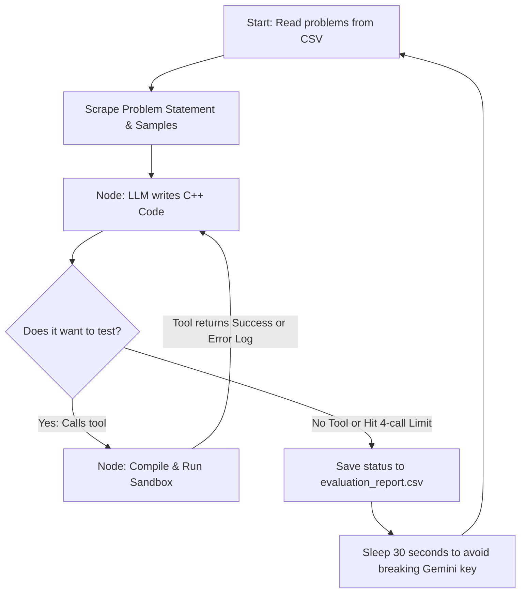

# Week 3 Assignment: Building a Self-Debugging Codeforces Agent

## GOAL
The goal was to build an AI agent that doesn't just guess code, but actually tests itself. I wanted to give it a Codeforces URL, have it scrape the problem, write the C++ code, run it against the sample test cases locally, see if it compiled/passed, and if it failed, look at the error log and fix its own code until it works.

---

## Breakdown

 ### 1. State:
A dictionary tht travels along the graph.

It holds two things :

a. A list of **messages** so the model remembers its past attempts

b. And a counter for the **number of attempts**, so that we can stop it from getting stuck in a hard error

### 2. Node:
There are two nodes:

a. **Code generator node** - gives geminin a system prompt about what to do, and also that it canot stop before atleast trying once

b. **Tool node** - it runs the custom `run_local_tests()` function. it writes the code to a local file and checks it agains the extracted sample cases, and then passes the output back to the llm

### 3. Conditional edge:
Deciding whether to continue or not  using the `should_continue()` function. if llm calls exceed 4 then we stop to prevent getting stuck

---

## How it actually works (The Workflow)

I used LangGraph to create a loop and LangChain to glue the tools and messages together. Here is the actual logic flow I figured out:

## Results

The agent was tested across 24 standard Codeforces problems with increasing difficulty (1100 to 1900). Below is result also stores in `evaluation_report.csv`:

| Problem URL | Rating | Status | Total Attempts |
| :--- | :--- | :--- | :--- |
| `.../problemset/problem/1511/C` | 1100 | `success` | 1 |
| `.../problemset/problem/1610/B` | 1100 | `success` | 2 |
| `.../problemset/problem/414/B` | 1400 | `success` | 2 |
| `.../problemset/problem/1167/C` | 1400 | `success` | 2 |
| `.../problemset/problem/1350/B` | 1400 | `success` | 3 |
| `.../problemset/problem/845/C` | 1500 | `success` | 3 |
| `.../problemset/problem/1101/C` | 1500 | `success` | 3 |
| `.../problemset/problem/891/A` | 1500 | `success` | 3 |
| `.../problemset/problem/1084/C` | 1500 | `success` | 1 |
| `.../problemset/problem/1106/D` | 1500 | `success` | 2 |
| `.../problemset/problem/1475/E` | 1600 | `success` | 2 |
| `.../problemset/problem/1610/C` | 1600 | `success` | 1 |
| `.../problemset/problem/1775/C` | 1600 | `success` | 2 |
| `.../problemset/problem/1516/C` | 1700 | `success` | 2 |
| `.../problemset/problem/1598/D` | 1700 | `success` | 2 |
| `.../problemset/problem/1625/C` | 1700 | `success` | 1 |
| `.../problemset/problem/1792/D` | 1700 | `success` | 1 |
| `.../problemset/problem/1893/B` | 1700 | `success` | 2 |
| `.../problemset/problem/1290/B` | 1800 | `success` | 1 |
| `.../problemset/problem/1338/B` | 1800 | `success` | 1 |
| `.../problemset/problem/1509/C` | 1800 | `success` | 2 |
| `.../problemset/problem/2044/F` | 1900 | `success` | 3 |
| `.../problemset/problem/2014/H` | 1900 | `success` | 1 |
| `.../problemset/problem/1925/D` | 1900 | `success` | 2 |

